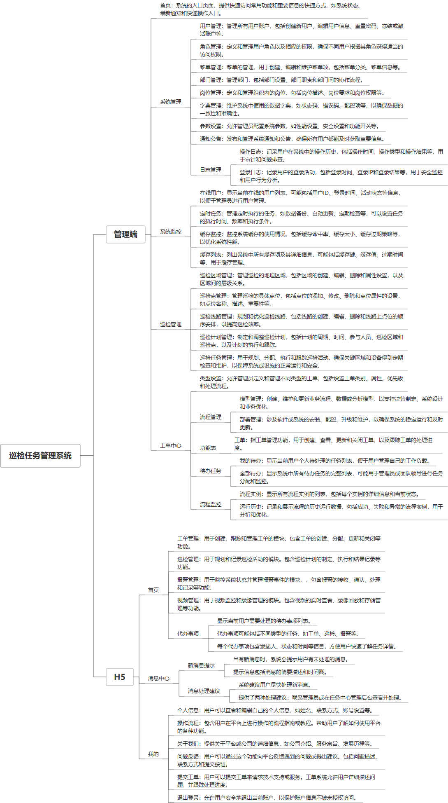

 

    
 

公司拥有上百套具有自主知识产权的软件系统，详情请查看码云首页或公司官网

 
<h1>巡检任务管理系统</h1>

<a href="https://www.haishi.net.cn/">公司官网</a> ｜ <a href="https://www.haishi.net.cn/">在线体验</a>

 

## 系统介绍

巡检任务管理、巡检抽查、巡检任务随机分派等功能
None
                

## 系统功能介绍

### 系统包含终端说明

管理端（WEB）、用户端（H5）

管理端（WEB）、用户端（H5）
| 序号 | 模块                | 模块说明 |
| ---- | ------------------- | -------- |
| 1    | FWY-TCM-XJRW-SERVER | 服务端   |
| 2    | FWY-TCM-XJRW-H5     | H5端     |
| 3    | FWY-TCM-XJRW-MANAGE | 管理端   |

### 系统功能结构

### 系统功能说明

- 系统管理：包括用户管理、角色管理、菜单管理、通知公告、日志管理等功能，可以对系统进行基础的配置和管理。
- 巡检管理：包括巡检区域管理、巡检点管理、巡检线路管理、巡检计划管理、巡检任务管理等功能，可以对巡检工作进行全面的计划和管理。
- 工单中心：包括类型设置、流程管理、工单、待办任务、流程监控等功能，可以对巡检过程中产生的问题进行跟踪处理。

## 系统主要界面

## 系统技术说明

### 代码模块说明

| 序号 | 目录                                 | 目录说明 |
| ---- | ------------------------------------ | -------- |
| 1    | FWY-TCM-XJRW-SERVER/px-tcm-framework | --       |
| 2    | FWY-TCM-XJRW-SERVER/px-tcm-admin     | --       |
| 3    | FWY-TCM-XJRW-SERVER/px-tcm-generator | --       |
| 4    | FWY-TCM-XJRW-SERVER/.github          | --       |
| 5    | FWY-TCM-XJRW-SERVER/px-tcm-common    | --       |
| 6    | FWY-TCM-XJRW-SERVER/px-tcm-system    | --       |
| 7    | FWY-TCM-XJRW-SERVER/px-tcm-quartz    | --       |
| 8    | FWY-TCM-XJRW-SERVER/.idea            | --       |

### 系统技术选型

#### 开发语言/框架

JAVA（JDK1.8）
前端框架：VUE2

#### 服务中间件

Nginx
Tomcat

#### 数据库

MySQL（5.7+）

#### 其他说明

无

## 系统演示/商用

请扫码添加客服微信获取演示地址和系统详细资料。

如果您想基于巡检任务管理系统进行商业化交付或定制开发服务，我们提供有偿的技术服务支持，合作模式不限，欢迎沟通！

公司官网地址： <a href="https://www.haishi.net.cn/">https://www.haishi.net.cn</a>

联系客服获取专业回答。

## 使用须知

1、 本项目商用必须获得版权所有者的授权。

2、 未经允许本项目代码不允许二次出售。

